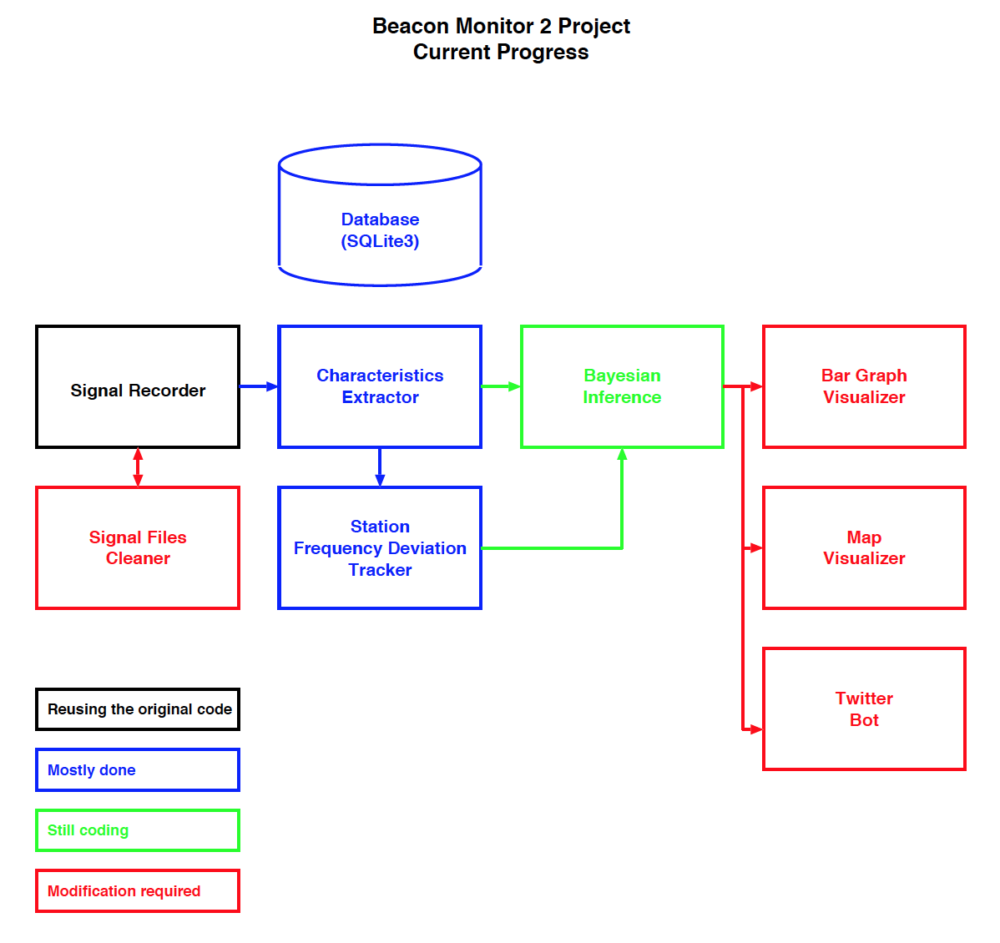

# Beacon Monitor-2 Project

Thank you for your attention and patience to the Beacon Monitor-2 Project.

After the statement on the web site (http://ayoko.net/beacon/) on
March, 2017, the progress was quite slow until this October.

However, due to getting more spare time :) , the progress is pretty
accelerating at the moment.

I decided to reuse the current "Signal Recorder", which was written by
C language, and started rewriting other (or succeeding) signal
processing parts by Python language so that the project software
becomes more portable (or be able to run on many PC or Raspberry Pi).
The original code was written by mixture of C language, Shell
scripting, GNU Octave, AWK and Python, so it sometime faces problems
that the code doesn't run on a different version of OS, GNU Octave, or
Bash.

# Current Status

The following shows the current progress.  (As of Nov. 11, 2017)

- Decided to reuse the Signal Recorder until the entire system will be
  rewritten by Python.  However, I guess I can provide the Signal
  Recorder as a binary form for a while.

- Migration software, which converts the output of Signal Recorder,
  was almost written by Nov. 3.

- Database engine (using SQLite3) was almost done as of today.

- Signal Characteristics Extractor was almost written by Nov. 6.

- Station Frequency Deviation Tracker was almost written by Nov. 10.

- Remaining code which I need to complete are,

    - Bayesian Inference code
	- Bar Graph Visualizer
	- Map Visualizer (may be postponed?)
	- Twitter bot (may be postponed?)
	
I guess, if I won't face any business problems, the above code will be
completed by end of this November or December.

Thank you for your additional patience...

Regards,

Atsushi Yokoyama (JN1SDD)
